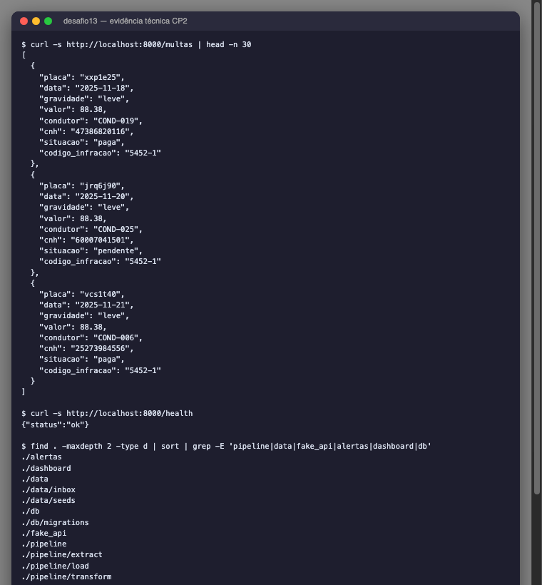
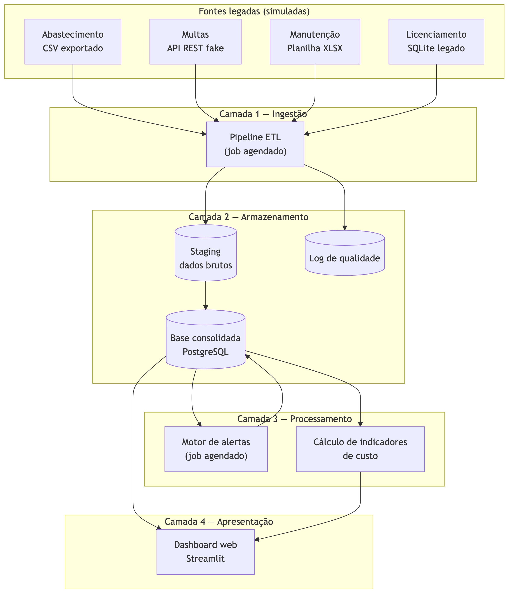
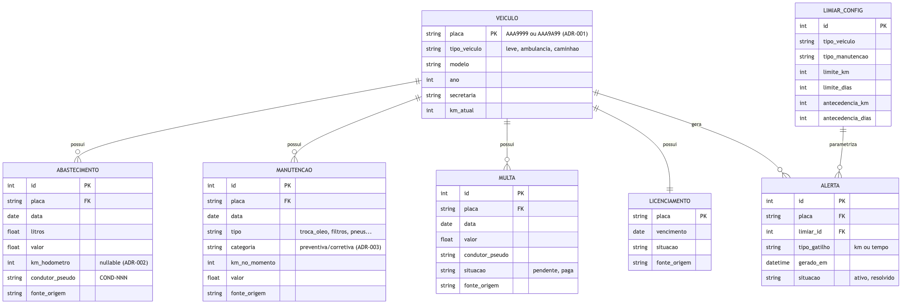

# Checkpoint 2 — Evoluir, Desafiar e Desbloquear

**Desafio 13 — Gestão Inteligente da Frota Municipal (Florianópolis)**

**Prazo de entrega:** 15/07/2026 às 23h59 (Horário de Brasília)

---

## Cabeçalho

| Campo | Valor |
|---|---|
| **Equipe** | Smart Fleet Floripa |
| **Desafio** | Desafio 13 — Gestão Inteligente da Frota Municipal (Florianópolis) |
| **Líder** | Rafael Ventura |
| **Nº de integrantes** | 5 |
| **Integrantes** | Rafael Ventura, Mauricio Telles Silva Bichels, Julio Barbosa de Souza, Michael Torres Faleiro, João Victor Duarte |
| **Situação no CP1** | Apta |

---

## 1. Dossiê de Evolução Técnica

*(Limite: 1–2 páginas · Evidência visual obrigatória)*

### O que já foi construído

**Fundação:** roadmap em 7 especificações (specs/001–007) com dependências mapeadas, 36 tasks no kanban por papel (dados, backend, frontend, docs). Arquitetura técnica v2 com 4 camadas, ERD de 8 tabelas, stack decidida (D1–D8) e 3 ADRs formais. Constitution com princípios inegociáveis + gitflow com revisão obrigatória.

**Software — Fase 1 concluída (spec 001):** `gerador_dados.py` determinístico (semente + data-âncora) produz as 4 fontes simuladas, cada uma num formato diferente, com inconsistências propositais documentadas: abastecimento em CSV (~1.600 registros), multas em API REST fake (FastAPI, 100 multas), manutenção em XLSX 3 abas (~250 registros), licenciamento em SQLite legado. Cenário determinístico da demo embutido: veículo A a ~600 km do limite (gatilho por km ao vivo) e veículo B com antecedência de tempo já cruzada. 10 testes automatizados passando.

> **Evidência visual:** endpoint `/multas` retornando JSON com placas em minúsculas e CNH sintética (LGPD); estrutura do pipeline ETL em `pipeline/extract|transform|load`; 4 datasets em `data/seeds/`; 10 testes automatizados passando.
>
> 

### Desafios técnicos superados

Não recebemos dados reais nem simulados da frota municipal, e não temos especialista em dados de frota no time. Dados simulados "genéricos demais" contaminariam pipeline, motor e dashboard — então gastamos tempo significativo em pesquisa dirigida, estudando sistemas análogos (cartão-combustível, planilhas de manutenção, integrações DETRAN), projetos e aplicativos de gestão de frotas para extrair faixas realistas de km/mês por tipo de veículo, consumo, valores de multa, calendário de licenciamento e planos de manutenção. Dessa pesquisa saíram três decisões formais (ADRs) que destravaram o caminho:

- **ADR-001** — a chave de reconciliação entre as 4 fontes é a placa, mas a frota real mistura os dois formatos brasileiros (antigo `AAA9999` e Mercosul `AAA9A99`); sem aceitar ambos, o cruzamento falhava e nenhuma fonte conversava com a outra.
- **ADR-002** — sem persistir o km do hodômetro no abastecimento, não existe série temporal de km; isso bloqueava o gatilho por quilometragem (spec 004) e o custo/km do painel de custos (spec 006).
- **ADR-003** — sem calibrar o realismo das fontes simuladas (faixas de km/mês por tipo, tabela CTB de multas, calendário DETRAN-SC, razão corretiva/preventiva 3–5×), a PoC não seria crível para a banca.

Cada ADR nasceu de um problema concreto que travava o time, foi registrada formalmente em `docs/decisoes/` e validada por teste automatizado.

### Gargalos atuais

- **Falta de especialista em dados/modelagem** — specs 002 (banco) e 003 (pipeline ETL) são bloqueantes para backend e frontend, e avançam mais devagar por curva de aprendizado.
- **Stack do dashboard não ratificada** — arquitetura aponta Streamlit (D3), mas frontend ainda precisa validar antes de iniciar a spec 005.
- **LGPD/anonimização em pesquisa** — pseudonimização na origem já implementada, mas o documento formal de conformidade depende de estudo em andamento.
- **Tempo gasto na fundação** — investimos mais que o planejado em pesquisa e arquitetura; avaliamos que foi o custo certo para não construir sobre base frágil.

### Impedimentos e Regularização do CP1

**CP1:** Apta, sem ressalvas ou pendências.

**Pedidos à mentoria:** (1) revisão rápida do ERD e das regras de qualidade do pipeline para destravar specs 002/003; (2) orientação sobre anonimização/pseudonimização LGPD em dados de servidores públicos.

---

## 2. Atualização da Arquitetura e Fluxo

*(Limite: 1 diagrama + máximo 150 palavras)*

*Arquitetura em 4 camadas — componentes conversam só via banco*

*ERD — 8 tabelas, placa canônica como chave de reconciliação*

A solução segue 4 camadas (ingestão → armazenamento → processamento → apresentação); os componentes conversam só via banco — dashboard nunca lê arquivo-fonte, motor nunca lê o pipeline. Fluxo do usuário: gestor abre o painel → vê frota com semáforo de urgência → alerta preventivo aparece sozinho (ciclo agendado de 1–2 min na demo) antes do vencimento. Mudanças desde o CP1 (v1 → v2, em ADRs): placa canônica aceita os dois formatos brasileiros (ADR-001); `km_hodometro` persistido no abastecimento, criando a série temporal de km (ADR-002); categoria preventiva/corretiva na manutenção (ADR-003). Estado: fontes prontas (Fase 1 ✅); banco e pipeline em construção; motor e dashboard na sequência.

*(106 palavras — limite: 150)*

---

## 3. Plano de Reta Final

*(Limite: máximo 200 palavras + Tabela de Cronograma)*

**Backlog restante (TRL 3):** modelagem do banco + migrations (spec 002) e pipeline ETL com log de qualidade e carga idempotente (spec 003) — bloqueantes, meta fim desta semana; motor de alertas por km/tempo com ciclo agendado (spec 004); dashboard com semáforo, alertas, toggle Gestor/Pública e auto-refresh (specs 005/006); Docker Compose, documento LGPD e ensaio da demo (spec 007).

**Divisão:** dados → specs 002/003; backend → specs 002/004 + Docker; frontend → specs 005/006; docs → LGPD, impacto econômico, roteiro da demo.

**Riscos e plano B:** (a) modelagem atrasar → congelar ERD v2 e ajustar via migration; (b) alerta ao vivo falhar → vídeo gravado do disparo; (c) stack do dashboard → default Streamlit (D3), sem reabrir após 17/07; (d) LGPD incompleta → pseudonimização já garantida na origem, documento mínimo com base legal por campo.

*(135 palavras — limite: 200)*

### Tabela de Cronograma

| Tarefa Crítica | Responsável | Prazo Interno | Status |
|---|---|---|---|
| Spec 002 — modelo de dados + migrations + LIMIAR_CONFIG | Dados + Backend | 17/Jul | Em andamento |
| Ratificar stack do dashboard (Streamlit) | Frontend | 17/Jul | A iniciar |
| Spec 003 — pipeline ETL (extratores, qualidade, upsert idempotente) | Dados | 18/Jul | Em andamento |
| Spec 004 — motor de alertas (km/tempo) + agendamento | Backend | 21/Jul | A iniciar |
| Spec 005 — painel frota/alertas + toggle público + auto-refresh | Frontend | 22/Jul | A iniciar |
| Documento LGPD/LAI/14.133 + anonimização | Docs | 22/Jul | Em pesquisa |
| Spec 006 — painel de custos + comparativo | Frontend | 23/Jul | A iniciar |
| Docker Compose funcional (1 comando) | Backend | 23/Jul | A iniciar |
| Teste de fluxo completo ponta a ponta | Todos | 23/Jul | A iniciar |
| Ensaio da demo (≥3x) + vídeo plano B | Todos | 24/Jul | A iniciar |
| Final presencial — demo ao vivo + pitch | Todos | 25/Jul | A iniciar |
