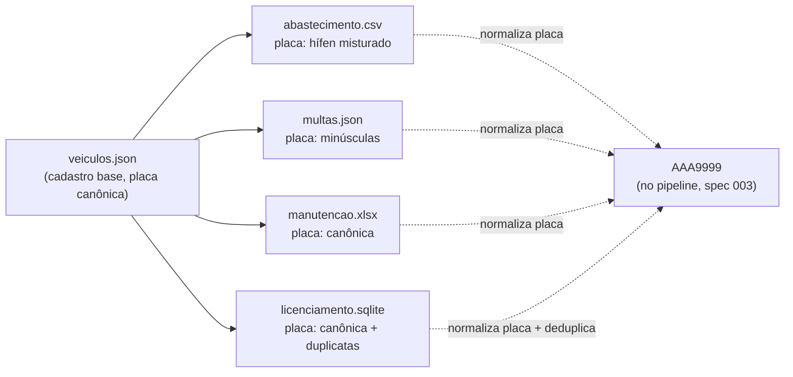

# Data Model — Fontes de Dados Simuladas (Spec 001)

**Branch**: `feature/001-fontes-dados-simuladas` | **Date**: 2026-07-14

Este documento descreve o **shape de cada fonte simulada** gerada por `data/gerador_dados.py`
— ou seja, a estrutura dos arquivos que o pipeline (spec 003) vai ingerir. **Não** descreve o
schema do banco consolidado (isso é a spec 002, `LIMIAR_CONFIG`/`VEICULO`/`ABASTECIMENTO`/...).

As fontes são **deliberadamente heterogêneas** (arquitetura §2, constitution III): cada uma
tem formato, padrão e inconsistências próprias. A placa é a chave de reconciliação, grafada
de formas diferentes em cada fonte (ver `research.md` R7).

---

## Cadastro base (referência interna do gerador)

**Arquivo**: `data/seeds/veiculos.json` (não é uma das 4 fontes legadas; é o cadastro
canônico que o gerador usa para derivar as 4 fontes com grafias divergentes).

```json
[
  {
    "placa": "ABC1234",           // canônico AAA9999 (maiúsculas, sem hífen)
    "tipo_veiculo": "leve",        // leve | ambulancia | caminhao
    "modelo": "Fiat Strada",       // sintético
    "ano": 2021,
    "secretaria": "Saúde",         // sintético
    "km_atual": 4400,              // para veículo da demo A; demais: aleatório dentro do limite
    "demo_gatilho": true,          // true para os 2 veículos da demo (índices 0 e 1)
    "demo_gatilho_tipo": "km"      // "km" | "tempo" | null
  }
]
```

**Regras de validação (internas do gerador)**:
- 40 veículos: ≈30 leves, 6 ambulâncias, 4 caminhões (decisão 2026-07-14).
- Placas únicas, formato `^[A-Z]{3}[0-9]{4}$`.
- Veículo índice 0: `demo_gatilho=true`, `demo_gatilho_tipo="km"`, `km_atual=4400`.
- Veículo índice 1: `demo_gatilho=true`, `demo_gatilho_tipo="tempo"`, `km_atual` aleatório
  dentro do limite; última `troca_oleo` há 166 dias (cruzou antecedência 165, não o limite 180).
- Demais 38: `demo_gatilho=false`, `km_atual` e datas de manutenção aleatórios *longe* dos
  limiares (sem alertas espúrios).

---

## Fonte 1 — Abastecimento (CSV)

**Arquivo**: `data/seeds/abastecimento.csv`
**Volume**: ~3.000 registros (40 veículos × ~75 abastecimentos em 8 meses).

| Coluna | Tipo (no CSV) | Exemplo | Inconsistência propositais |
|---|---|---|---|
| `placa` | TEXT | `ABC-1234` / `ABC1234` | ~50% com hífen, ~50% sem hífen (mistura) |
| `data` | TEXT | `14/07/2026` / `2026-07-14` | Mistura de `dd/mm/aaaa` e `aaaa-mm-dd` |
| `litros` | TEXT | `45,5` | Vírgula decimal (não ponto) |
| `valor` | TEXT | `350,75` | Vírgula decimal |
| `condutor` | TEXT | `COND-042` | Pseudônimo (sem inconsistência — LGPD desde a origem) |
| `km` | TEXT | `4400` | Hodômetro lido no posto (clarificação 2026-07-14); usado pelo pipeline para atualizar `veiculo.km_atual`, **não persistido** na tabela consolidada |

**Arquivo especial — Gatilho da demo**: `data/seeds/gatilho_demo_abastecimento.csv`
Mesma estrutura de colunas. Contém **1 registro** para o veículo da demo A (índice 0): um
abastecimento cujo `km` eleva `km_atual` de 4400 para ≥ 4501, cruzando o limiar de
antecedência (`limite_km - antecedencia_km = 5000 - 500 = 4500`). Depositado em
`data/inbox/` durante a apresentação para disparar o alerta ao vivo.

---

## Fonte 2 — Multas (JSON servido por API)

**Arquivo**: `fake_api/multas.json` (servido por `fake_api/main.py`, ver `contracts/api_multas.md`)
**Volume**: ~200 registros.

```json
[
  {
    "placa": "abc1234",            // minúsculas, sem hífen (inconsistência propositais)
    "data": "2026-05-20",          // aaaa-mm-dd
    "valor": 130.16,               // número (ponto decimal — difere do CSV de abastecimento)
    "condutor": "COND-042",        // pseudônimo
    "cnh": "01234567890",          // 11 dígitos sintéticos, checksum inválido (research R2)
    "situacao": "pendente",        // pendente | paga
    "codigo_infracao": "7455-1"    // código do enquadramento (Portaria 354/2022, Bloco 5)
  }
]
```

**Inconsistências propositais**: placa em minúsculas; campo `cnh` presente (dado pessoal —
espelha Bloco 3 do AIT, Portaria SENATRAN 354/2022). O pipeline (spec 003) descarta `cnh` na
carga consolidada e persiste só `condutor_pseudo` (LGPD, constitution IV).

**Validação**: nenhum nome, CPF ou CNH real (SC-003). O `cnh` sintético não passa na
validação oficial de checksum (módulo 11) — obviamente não-real.

---

## Fonte 3 — Manutenção (XLSX multi-abas)

**Arquivo**: `data/seeds/manutencao.xlsx`
**Volume**: ~600 registros distribuídos em 3 abas.

**Abas** (cada uma espelha uma oficina/setor diferente, com padrões de texto inconsistentes):
1. `Oficina Central`
2. `Oficina Regional Norte`
3. Manutenção Terceirizada`

**Estrutura de colunas (mesma em todas as abas)**:

| Coluna | Tipo (no XLSX) | Exemplo | Inconsistência propositais |
|---|---|---|---|
| `placa` | TEXT | `ABC1234` | Maiúsculas sem hífen (canônico — esta fonte é a "limpa" em termos de placa) |
| `data` | TEXT / serial Excel | `2026-03-15` / `46068` | Mistura de `aaaa-mm-dd` (TEXT) e serial Excel (INTEGER) |
| `tipo` | TEXT | `troca de oleo` / `Troca Óleo` / `TROCA_OLEO` | Texto livre, sem padronização (normaliza para `troca_oleo` no pipeline) |
| `km_no_momento` | INTEGER / vazio | `4400` / `(vazio)` | Km ausente em ~15% dos registros (gera alerta `dados_insuficientes` no motor se aplicável) |
| `valor` | FLOAT | `280.50` | Ponto decimal (difere do CSV de abastecimento) |

**Regras de posicionamento da demo**: a última `troca_oleo` do veículo A (índice 0) tem
`km_no_momento` tal que `km_atual - km_no_momento = 4400` (faltam 600 para o limite 5000).
A última `troca_oleo` do veículo B (índice 1) tem `data` há 166 dias (cruzou antecedência 165).

---

## Fonte 4 — Licenciamento (SQLite)

**Arquivo**: `data/seeds/licenciamento.sqlite`
**Volume**: ~48 registros (40 veículos + ~8 duplicatas).

**Tabela**: `licenciamento`

| Coluna | Tipo (SQLite) | Exemplo | Inconsistência propositais |
|---|---|---|---|
| `placa` | TEXT | `ABC1234` | Maiúsculas sem hífen, mas com **duplicatas** (~20% dos veículos têm 2 registros: vencimento antigo + atual) |
| `vencimento` | TEXT / INTEGER | `15/08/2026` / `2026-08-15` / `46042` | Formatos mistos: `dd/mm/aaaa` (TEXT), `aaaa-mm-dd` (TEXT), serial Excel (INTEGER) |
| `situacao` | TEXT | `em_dia` / `vencido` | Sem inconsistência (vocabulário já padronizado nesta fonte) |

**Esquema SQL** (criado pelo gerador):
```sql
CREATE TABLE licenciamento (
    placa       TEXT NOT NULL,
    vencimento  TEXT,  -- tipo frouxo: aceita TEXT e INTEGER (serial Excel)
    situacao    TEXT
);
-- Sem PRIMARY KEY propositalmente — espelha "banco legado sem modelagem cuidadosa"
-- e permite as duplicatas propositais.
```

---

## Limiares-semente (referência de posicionamento)

**Arquivo**: `data/seeds/limiares_semente.json` (espelha os valores que a spec 002
formalizará em `LIMIAR_CONFIG`; ver `plan.md` § Complexity Tracking para a justificativa
de duplicação local).

```json
[
  {"tipo_veiculo": "leve", "tipo_manutencao": "troca_oleo", "limite_km": 5000, "limite_dias": 180, "antecedencia_km": 500, "antecedencia_dias": 15},
  {"tipo_veiculo": "leve", "tipo_manutencao": "filtros", "limite_km": 5000, "limite_dias": 180, "antecedencia_km": 500, "antecedencia_dias": 15},
  {"tipo_veiculo": "leve", "tipo_manutencao": "pneus", "limite_km": 40000, "limite_dias": 720, "antecedencia_km": 2000, "antecedencia_dias": 30},
  {"tipo_veiculo": "leve", "tipo_manutencao": "revisao_geral", "limite_km": 20000, "limite_dias": 365, "antecedencia_km": 1000, "antecedencia_dias": 30},
  {"tipo_veiculo": "ambulancia", "tipo_manutencao": "troca_oleo", "limite_km": 5000, "limite_dias": 180, "antecedencia_km": 500, "antecedencia_dias": 15},
  {"tipo_veiculo": "ambulancia", "tipo_manutencao": "revisao_geral", "limite_km": 20000, "limite_dias": 365, "antecedencia_km": 1000, "antecedencia_dias": 30},
  {"tipo_veiculo": "caminhao", "tipo_manutencao": "troca_oleo", "limite_km": 10000, "limite_dias": 180, "antecedencia_km": 1000, "antecedencia_dias": 15},
  {"tipo_veiculo": "caminhao", "tipo_manutencao": "pneus", "limite_km": 60000, "limite_dias": 720, "antecedencia_km": 3000, "antecedencia_dias": 30},
  {"tipo_veiculo": "caminhao", "tipo_manutencao": "revisao_geral", "limite_km": 30000, "limite_dias": 365, "antecedencia_km": 1500, "antecedencia_dias": 30}
]
```

---

## Relacionamentos entre as fontes

As 4 fontes não têm chaves estrangeiras entre si (são sistemas legados isolados). A
reconciliação acontece no pipeline (spec 003) via **normalização da placa** para o formato
canônico `AAA9999`. O diagrama abaixo mostra a relação lógica (não física):



## Estados / transições

Esta spec não tem transições de estado de domínio (é um gerador de arquivos estáticos). O
único "estado" é a marca `demo_gatilho` no cadastro base (estático, não muda). Transições de
estado (alerta ativo → resolvido, situação da multa pendente → paga) são concerns das specs
004 (motor) e 002 (modelo consolidado), não desta.
