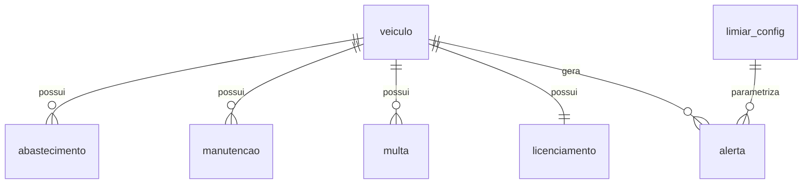

# Data Model — Modelo de Dados e Banco Consolidado (Spec 002)

**Branch**: `feature/002-modelo-dados-banco` | **Date**: 2026-07-16

Materialização do ERD da arquitetura v2 §4 (+ ADRs 001–003) em 12 tabelas: 7 consolidadas,
4 de staging e `log_qualidade`. Tipos indicados no dialeto SQLAlchemy (portáveis
SQLite ↔ PostgreSQL — decisão D2). Nomes de tabela em `snake_case` minúsculo.

**Convenções transversais**:
- Toda consolidada carrega `fonte_origem` (constitution II; inclui `veiculo` — ver research R8).
- Todo staging carrega `carga_em` + `fonte_origem` e usa **TEXT frouxo** (research R5).
- Placa canônica: `^[A-Z]{3}[0-9][A-Z0-9][0-9]{2}$` (ADR-001), validada na aplicação
  (`@validates`) + `CHECK length(placa) = 7` no banco (research R3).
- Vocabulários em snake_case; CHECKs de enumeração portáteis (`IN (...)`).

---

## 1. Consolidadas

### `veiculo`

| Coluna | Tipo | Constraints | Nota |
|---|---|---|---|
| `placa` | String(7) | **PK**; CHECK `length(placa) = 7`; regex dual na aplicação | canônico ADR-001 |
| `tipo_veiculo` | String | NOT NULL; CHECK IN (`leve`, `ambulancia`, `caminhao`) | chave de lookup da LIMIAR_CONFIG |
| `modelo` | String | NULL | ex.: "Fiat Strada" |
| `ano` | Integer | NULL | |
| `secretaria` | String | NULL | |
| `km_atual` | Integer | NOT NULL, DEFAULT 0 | atualizado pelo pipeline com a maior leitura válida (ADR-002) |
| `fonte_origem` | String | NOT NULL | adição consciente ao ERD — constitution II (research R8) |

### `abastecimento`

| Coluna | Tipo | Constraints | Nota |
|---|---|---|---|
| `id` | Integer | PK autoincremento | |
| `placa` | String(7) | FK → `veiculo.placa`, NOT NULL, índice | |
| `data` | Date | NOT NULL | |
| `litros` | Numeric(8,2) | NULL | |
| `valor` | Numeric(10,2) | NULL | |
| `km_hodometro` | Integer | **NULL** | leitura do odômetro no abastecimento — série temporal de km (ADR-002) |
| `condutor_pseudo` | String | NULL; formato `COND-NNN` | LGPD D8 |
| `fonte_origem` | String | NOT NULL | |
| — | — | **UNIQUE `(placa, data, km_hodometro)`** | chave de upsert do pipeline (research R7). **km NULL não colide** (NULL≠NULL) — deliberado: dois abastecimentos sem km no mesmo dia podem ser eventos reais; dedup fina é do pipeline (ADR-004) |

### `manutencao`

| Coluna | Tipo | Constraints | Nota |
|---|---|---|---|
| `id` | Integer | PK autoincremento | |
| `placa` | String(7) | FK → `veiculo.placa`, NOT NULL, índice | |
| `data` | Date | NOT NULL | |
| `tipo` | String | NOT NULL; CHECK IN (`troca_oleo`, `filtros`, `pneus`, `revisao_geral`) | vocabulário canônico (normalizado pela spec 003) |
| `categoria` | String | NOT NULL; CHECK IN (`preventiva`, `corretiva`) | ADR-003 item 7 — habilita o comparativo 3–5× do painel de custos |
| `km_no_momento` | Integer | NULL | ausência tratada pelo motor (`dados_insuficientes`) |
| `valor` | Numeric(10,2) | NULL | |
| `fonte_origem` | String | NOT NULL | |
| — | — | **UNIQUE `(placa, data, tipo)`** | chave natural da dedup (spec 003 FR-004) |

### `multa`

| Coluna | Tipo | Constraints | Nota |
|---|---|---|---|
| `id` | Integer | PK autoincremento | |
| `placa` | String(7) | FK → `veiculo.placa`, NOT NULL, índice | |
| `data` | Date | NOT NULL | |
| `valor` | Numeric(10,2) | NOT NULL | tabela CTB (fonte); `gravidade`/`codigo_infracao`/`cnh` são fonte-apenas e NÃO existem aqui (ADR-003; minimização LGPD) |
| `condutor_pseudo` | String | NULL; formato `COND-NNN` | |
| `situacao` | String | NOT NULL; CHECK IN (`pendente`, `paga`) | |
| `fonte_origem` | String | NOT NULL | |
| — | — | **UNIQUE por expressão `ux_multa_upsert`: `(placa, data, valor, coalesce(condutor_pseudo, ''))`** | chave pragmática de upsert (research R7). O `coalesce('')` faz multas **sem condutor também colidirem** — sem ele, NULL≠NULL deixava duplicatas entrarem (migration 0002, ADR-004) |

### `licenciamento` (1:1 com veículo)

| Coluna | Tipo | Constraints | Nota |
|---|---|---|---|
| `placa` | String(7) | **PK**; FK → `veiculo.placa` | 1:1 — upsert substitui pelo registro mais recente (dedup na spec 003) |
| `vencimento` | Date | NULL | |
| `situacao` | String | NULL; CHECK IN (`em_dia`, `vencido`) | |
| `fonte_origem` | String | NOT NULL | |

### `limiar_config`

| Coluna | Tipo | Constraints | Nota |
|---|---|---|---|
| `id` | Integer | PK autoincremento | |
| `tipo_veiculo` | String | NOT NULL | |
| `tipo_manutencao` | String | NOT NULL | |
| `limite_km` | Integer | NOT NULL | |
| `limite_dias` | Integer | NOT NULL | |
| `antecedencia_km` | Integer | NOT NULL | ex.: 500 |
| `antecedencia_dias` | Integer | NOT NULL | ex.: 15 |
| — | — | **UNIQUE `(tipo_veiculo, tipo_manutencao)`** | chave do upsert do seed (research R4) |

- **Seed**: 9 linhas lidas de `data/seeds/limiares_semente.json` (fonte única — spec 001).
  Upsert que **não sobrescreve** valor existente: alteração feita ao vivo na demo sobrevive a re-init.
- **Runtime**: editável por UPDATE direto; nenhum componente pode cachear os valores em
  memória de processo (SC-002 — o motor relê a cada verificação).
- Par (tipo_veiculo, tipo_manutencao) **sem** linha aqui = "não avaliável" para o motor
  (edge case da spec: ausência detectável, sem default silencioso).

### `alerta`

| Coluna | Tipo | Constraints | Nota |
|---|---|---|---|
| `id` | Integer | PK autoincremento | |
| `placa` | String(7) | FK → `veiculo.placa`, NOT NULL, índice | |
| `limiar_id` | Integer | FK → `limiar_config.id`, **NULL** | NULL somente para `dados_insuficientes` (spec 004 US4) |
| `tipo_gatilho` | String | NOT NULL; CHECK IN (`km`, `tempo`, `dados_insuficientes`) | |
| `gerado_em` | DateTime | NOT NULL | |
| `situacao` | String | NOT NULL, DEFAULT `ativo`; CHECK IN (`ativo`, `resolvido`) | histórico permanente — nunca DELETE (FR-005) |
| `detalhe` | String | NULL | "o que falta" no `dados_insuficientes` (spec 004 FR-005) |
| — | — | **UNIQUE parcial `ux_alerta_ativo`: `(placa, tipo_gatilho, coalesce(limiar_id, -1))` WHERE `situacao = 'ativo'`** | idempotência garantida no banco (research R6); resolvido não bloqueia recorrência |

---

## 2. Staging (`stg_*`) — tipos frouxos, uma por fonte

Colunas de dados espelham 1:1 os contratos da spec 001 (`contracts/formatos_arquivo.md`,
`contracts/api_multas.md`), **todas TEXT nullable**. Trio de rastreabilidade em todas:
`id` (PK), `carga_em` (DateTime NOT NULL), `fonte_origem` (TEXT NOT NULL — arquivo/endpoint).

| Tabela | Colunas de dados (todas TEXT) |
|---|---|
| `stg_abastecimento` | `placa`, `data`, `litros`, `valor`, `condutor`, `km` |
| `stg_multas` | `placa`, `data`, `gravidade`, `valor`, `condutor`, `cnh`, `situacao`, `codigo_infracao` |
| `stg_manutencao` | `placa`, `data`, `tipo`, `categoria`, `km_no_momento`, `valor`, `aba_origem` |
| `stg_licenciamento` | `placa`, `vencimento`, `situacao` |

Sem FKs, CHECKs ou UNIQUEs — dado sujo é entrada esperada (constitution III); a qualidade é
imposta na transformação (spec 003). `stg_multas.cnh` é dado bruto sintético; o descarte
acontece na consolidação (spec 003 FR-011) e o expurgo se apoia em `carga_em` (research R5).

## 3. `log_qualidade`

| Coluna | Tipo | Constraints | Nota |
|---|---|---|---|
| `id` | Integer | PK autoincremento | |
| `fonte` | String | NOT NULL | `abastecimento` \| `multas` \| `manutencao` \| `licenciamento` |
| `registro_bruto` | Text | NOT NULL | registro original serializado (JSON) |
| `motivo_rejeicao` | String | NOT NULL | vocabulário snake_case: `placa_invalida`, `data_ausente`, `data_invalida`, `duplicado`, `tipo_desconhecido`, ... |
| `carga_em` | DateTime | NOT NULL | |

Nunca há rejeição silenciosa: todo descarte do pipeline insere aqui (constitution II).

---

## 4. Índices de consulta (além de PKs/UNIQUEs)

| Índice | Tabela(colunas) | Consumidor |
|---|---|---|
| `ix_abastecimento_placa_data` | `abastecimento (placa, data)` | custo/km por período (spec 006) |
| `ix_manutencao_placa_tipo_data` | `manutencao (placa, tipo, data)` | motor: última manutenção por tipo (spec 004) |
| `ix_multa_placa_data` | `multa (placa, data)` | drill-down e custos (specs 005/006) |
| `ix_alerta_situacao` | `alerta (situacao)` | painel de alertas ativos (spec 005) |
| `ix_licenciamento_vencimento` | `licenciamento (vencimento)` | semáforo "vence esta semana" (spec 005) |

## 5. Relacionamentos (resumo)

Staging e `log_qualidade` não têm FKs (isolados por design). Não existe NENHUMA tabela ou
coluna ligando `condutor_pseudo` a identidade real — ausência verificada por teste de
introspecção (SC-003).

## 6. Estados / transições

- `alerta.situacao`: `ativo → resolvido` (transição única; sem DELETE; recorrência = nova linha
  `ativo`, permitida pelo índice parcial).
- `multa.situacao` (`pendente`/`paga`) e `licenciamento.situacao` (`em_dia`/`vencido`) são
  estados vindos das fontes — o pipeline atualiza por upsert; o banco não tem máquina de estados.
