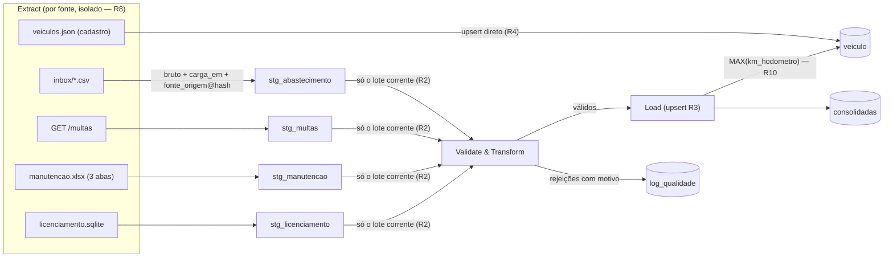

# Data Model — Pipeline ETL (Spec 003)

**Branch**: `feature/003-pipeline-etl` | **Date**: 2026-07-17

Esta spec **não cria nem altera tabelas** — o esquema pertence à spec 002
(`specs/002-modelo-dados-banco/contracts/esquema_tabelas.md`, migrations `0001`/`0002`).
Este documento modela o **fluxo do dado** através dele: o que cada extrator escreve no
staging, que regra transforma cada coluna e em que chave o load faz upsert.

## Fluxo de um ciclo

**Ordem do ciclo**: cadastro `veiculo` primeiro (FK de tudo — R4), depois as 4 fontes de
eventos em sequência fixa (abastecimento → multas → manutenção → licenciamento; ordem
irrelevante entre si, fixada por determinismo de teste).

## Conceitos transversais

| Conceito | Definição |
|---|---|
| **Lote de carga** | Conjunto de linhas de staging inseridas por uma fonte num ciclo, identificado por `carga_em` (timestamp único atribuído no início da extração da fonte). O transform opera por lote (R2). |
| **`fonte_origem` (staging)** | `<identificador>@sha256:<12 hex>` — identificador é caminho relativo do arquivo (`data/inbox/abastecimento.csv`), URL do endpoint ou caminho do .sqlite/.xlsx; hash é do conteúdo (R1). |
| **`fonte_origem` (consolidada)** | Copiado do registro de staging que originou o dado — rastreável até a carga (SC-003). No cadastro: `data/seeds/veiculos.json@sha256:<hash>`. |
| **Novidade** | Fonte cujo hash de conteúdo ainda não existe no seu staging (R1). Sem novidade → fonte pulada no ciclo (staging e log intactos). |
| **Duplicata intra-lote** | 2ª ocorrência da chave natural dentro do mesmo lote → `log_qualidade` motivo `duplicado` (R3). Reaparição entre ciclos = idempotência (no-op, sem log). |

## Fonte 1 — Abastecimento (CSV da pasta monitorada)

**Extract**: varre `PIPELINE_INBOX` (default `data/inbox/`), arquivos `*.csv`; cada arquivo
novo (por hash) vira um lote em `stg_abastecimento` — colunas do CSV copiadas **verbatim**
(contrato spec 001 `formatos_arquivo.md`).

**Transform → Load** (alvo `abastecimento`; chave de upsert `(placa, data, km_hodometro)`;
km NULL não colide — exceção deliberada, ADR-004 caminho 2):

| Staging (TEXT) | Regra | Consolidada | Rejeição possível |
|---|---|---|---|
| `placa` | canônica ADR-001 (upper, sem hífen/espaço, regex dual) + existe no cadastro | `placa` (FK) | `placa_invalida`, `veiculo_desconhecido` |
| `data` | parsing tolerante R5 (`dd/mm/aaaa` \| ISO) | `data` | `data_ausente`, `data_invalida` |
| `litros` | vírgula→ponto, float ≥ 0 | `litros` | `valor_invalido` |
| `valor` | vírgula→ponto, float ≥ 0 | `valor` | `valor_invalido` |
| `condutor` | `COND-NNN` (já pseudonimizado na fonte) | `condutor_pseudo` | — |
| `km` | inteiro; **ausente é válido** (nullable, ADR-002) | `km_hodometro` | `valor_invalido` (se presente e não numérico) |

**Pós-carga**: `veiculo.km_atual` ← `MAX(km_hodometro)` consolidado da placa, se superar o
atual (R10; FR-010). Leitura decrescente **não** rejeita (juízo de confiabilidade é do
motor, spec 004).

## Fonte 2 — Multas (API JSON)

**Extract**: `GET {MULTAS_API_URL}/multas` (httpx, timeout 5s — R9); payload novo (por hash)
vira lote em `stg_multas` com **todos** os campos brutos, incluindo `cnh`, `gravidade` e
`codigo_infracao` (staging é trilha bruta — research R5 da spec 002).

**Transform → Load** (alvo `multa`; chave `ux_multa_upsert (placa, data, valor,
coalesce(condutor_pseudo,''))` — ADR-004; conflito capturado por `do_nothing` sem alvo, R3):

| Staging | Regra | Consolidada | Rejeição possível |
|---|---|---|---|
| `placa` (minúsculas) | canônica ADR-001 + cadastro | `placa` (FK) | `placa_invalida`, `veiculo_desconhecido` |
| `data` (ISO) | parsing R5 | `data` | `data_ausente`, `data_invalida` |
| `valor` | float | `valor` (NOT NULL) | `valor_invalido` |
| `condutor` | `COND-NNN` | `condutor_pseudo` | — |
| `situacao` | ∈ {pendente, paga} | `situacao` | `situacao_desconhecida` |
| `cnh` | **descartada** (FR-011 — minimização LGPD; a consolidada nem tem a coluna) | — | — |
| `gravidade`, `codigo_infracao` | **descartados** (fonte-apenas, ADR-003) | — | — |

## Fonte 3 — Manutenção (XLSX, 3 abas)

**Extract**: lê as 3 abas (`Oficina Central`, `Oficina Regional Norte`, `Manutenção
Terceirizada`) via pandas/openpyxl; cada linha vai a `stg_manutencao` com `aba_origem` =
nome da aba (contrato 002). Aba inesperada ou coluna fora de ordem não quebra o ciclo
(leitura por nome de coluna; aba desconhecida é ignorada com `logging.warning` — edge case).

**Transform → Load** (alvo `manutencao`; chave `(placa, data, tipo)` — dedup FR-004 na
mesma chave, intra-lote):

| Staging | Regra | Consolidada | Rejeição possível |
|---|---|---|---|
| `placa` | canônica + cadastro | `placa` (FK) | `placa_invalida`, `veiculo_desconhecido` |
| `data` (TEXT ISO \| serial Excel) | parsing R5 (3 formatos) | `data` | `data_ausente`, `data_invalida` |
| `tipo` (texto livre) | vocabulário R6 → {troca_oleo, filtros, pneus, revisao_geral} | `tipo` | `tipo_desconhecido` |
| `categoria` (grafias variadas) | R6 → {preventiva, corretiva} | `categoria` | `categoria_desconhecida` |
| `km_no_momento` | inteiro; ausente é válido (nullable) | `km_no_momento` | `valor_invalido` |
| `valor` (ponto decimal) | float | `valor` | `valor_invalido` |

## Fonte 4 — Licenciamento (SQLite legado)

**Extract**: conexão somente-leitura ao arquivo `PIPELINE_SQLITE_LICENCIAMENTO` (default
`data/seeds/licenciamento.sqlite`), `SELECT * FROM licenciamento`; linhas brutas (incluindo
duplicatas) → `stg_licenciamento`.

**Transform → Load** (alvo `licenciamento`, 1:1 por `placa`; upsert `do_update` — R3):

| Staging | Regra | Consolidada | Rejeição possível |
|---|---|---|---|
| `placa` (com duplicatas) | canônica + cadastro; **dedup por placa mantendo o vencimento mais recente** — a linha preterida → `duplicado` | `placa` (PK/FK) | `placa_invalida`, `veiculo_desconhecido`, `duplicado` |
| `vencimento` (3 formatos) | parsing R5 | `vencimento` | `data_invalida` (ausente é válido — coluna nullable) |
| `situacao` | ∈ {em_dia, vencido} | `situacao` | `situacao_desconhecida` |

## Cadastro — `veiculos.json` (não é fonte legada)

Upsert direto em `veiculo` por `placa`, sem staging (R4): `tipo_veiculo`, `modelo`, `ano`,
`secretaria` do JSON; `km_atual` **nunca é rebaixado** pelo cadastro (só o R10 o eleva);
`fonte_origem = data/seeds/veiculos.json@sha256:<hash>`.

## Rejeição (log_qualidade)

Uma linha por registro rejeitado ou falha de fonte (R7/R8):

| Campo | Conteúdo |
|---|---|
| `fonte` | identificador curto da fonte (`abastecimento`, `multas`, `manutencao`, `licenciamento`, `cadastro`) |
| `registro_bruto` | a linha original serializada (dict→JSON) — ou descrição do erro, em `fonte_indisponivel` |
| `motivo_rejeicao` | vocabulário fechado R7 |
| `carga_em` | timestamp do lote (correlaciona com o staging) |

**Regra de precedência de motivos** (1 registro = 1 motivo, o primeiro que falhar):
placa → data → valores numéricos → vocabulários → cadastro (`veiculo_desconhecido`) →
dedup (`duplicado`). Determinístico para os testes de SC-002.

## Invariantes (o que os testes de aceitação fixam)

1. **Idempotência** (SC-001): 2ª execução sem dados novos → contagens e conteúdo idênticos
   em consolidadas **e** `log_qualidade`; staging sem lote novo.
2. **Cobertura de rejeição** (SC-002): todo inválido proposital de
   `data/seeds/INCONSISTENCIAS.md` presente em `log_qualidade` com o motivo previsto.
3. **Rastreabilidade** (SC-003): toda linha consolidada tem `fonte_origem` não-vazio no
   formato com hash; todo staging tem `carga_em`.
4. **Isolamento** (SC-005): com a API de multas fora, as outras 3 fontes consolidam 100% e
   existe `fonte_indisponivel` para `multas` no ciclo.
5. **LGPD** (FR-011): nenhum valor de `cnh` presente em qualquer consolidada (o staging
   retém o bruto por auditoria — expurgo via `carga_em`).
6. **km monotônico** (FR-010): `veiculo.km_atual` nunca diminui após qualquer sequência de
   cargas.
