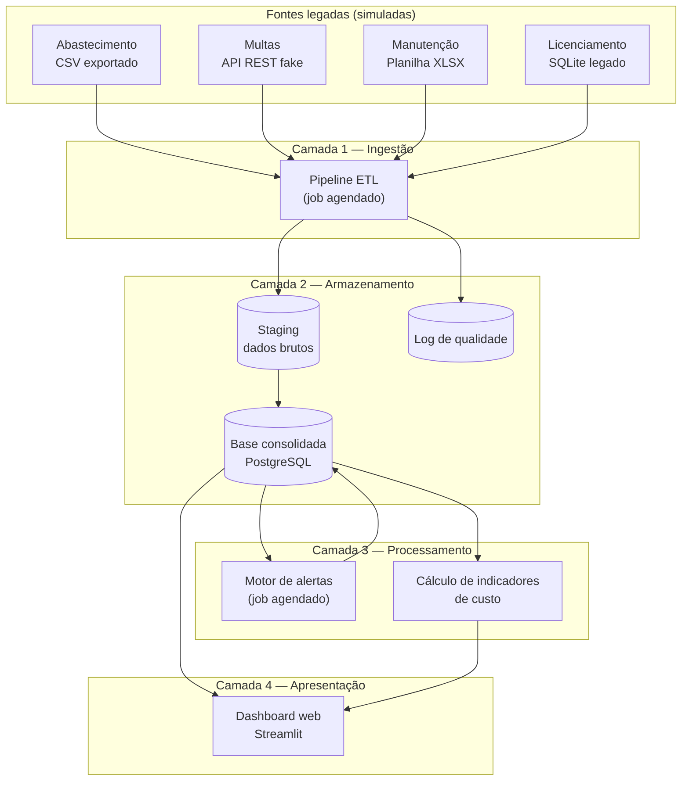
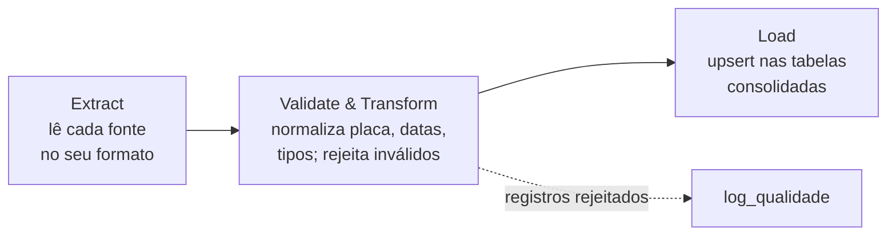
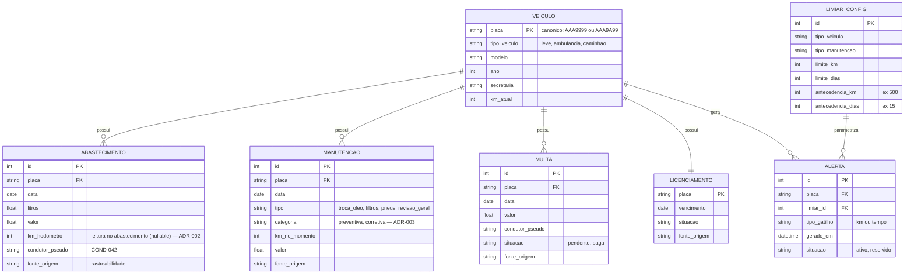
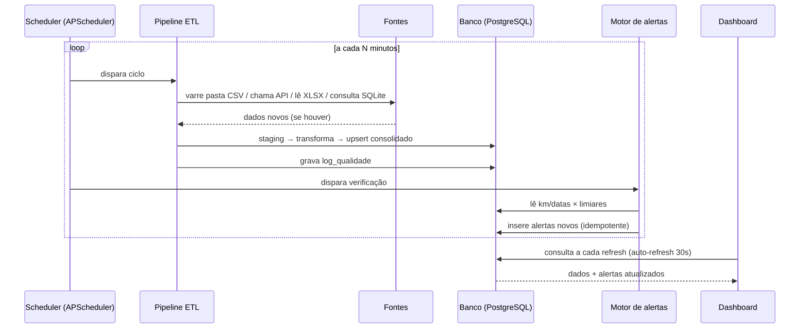

# Documento Técnico de Arquitetura — Desafio 13: Gestão Inteligente da Frota Municipal

**Versão:** 2.0 · **Data:** 14/07/2026
**Complementa:** `roadmap_desafio13_frota_municipal.md` (visão de fases) e o documento do Checkpoint 1
**Substitui:** `arquitetura_tecnica_desafio13_v1.md` (mudanças registradas no histórico de versões, seção 12, e nos ADRs `docs/decisoes/ADR-001` e `ADR-002`)
**Público:** equipe técnica do projeto

Este documento consolida as decisões de arquitetura, a stack tecnológica e os esquemas técnicos da PoC. O roadmap responde *quando* fazemos cada coisa; este documento responde *como*.

---

## 1. Visão geral da arquitetura

A PoC segue as quatro camadas exigidas pelo briefing (seção 5): **ingestão**, **armazenamento**, **processamento** e **apresentação**. Cada camada é um componente isolado que se comunica com a seguinte exclusivamente através do banco de dados — o que simplifica o desenvolvimento em paralelo pela equipe e torna a documentação de arquitetura direta.



**Princípio central:** o dashboard nunca lê arquivos-fonte, e o motor de alertas nunca lê o pipeline. Todos os componentes conversam apenas com o banco. Assim, quando o pipeline roda de novo, tudo "atualiza sozinho" sem integração adicional.

---

## 2. Fontes de dados da PoC

Para demonstrar a heterogeneidade real das fontes municipais (risco nº 1 do briefing), cada fonte simulada usa deliberadamente **um formato e um padrão de dados diferente**:

| Fonte | Formato simulado | Simula na vida real | Inconsistências propositais |
|---|---|---|---|
| Abastecimento | CSV depositado em pasta monitorada | Exportação de planilha paralela / sistema de cartão-combustível | Placa com e sem hífen; datas `dd/mm/aaaa` e `aaaa-mm-dd`; litros com vírgula decimal |
| Multas | Endpoint JSON (mini-API FastAPI) | Sistema com API (ex.: integração DETRAN) | Campo de placa em minúsculas; CNH do condutor presente (dado pessoal) |
| Manutenção | XLSX com múltiplas abas | Planilha do setor de manutenção | Km ausente em alguns registros; tipos de manutenção sem padronização de texto |
| Licenciamento | Tabela SQLite acessada via conexão SQL | Banco de sistema legado interno | Placas duplicadas; vencimento em formatos distintos |

**Regra de reconciliação:** a **placa do veículo** é a chave que une todas as fontes. O pipeline normaliza toda placa para o formato canônico — **maiúsculas, sem hífen e sem espaços** — aceitando os **dois formatos vigentes no Brasil** (ADR-001):

- Antigo: `AAA9999` (3 letras + 4 dígitos)
- Mercosul: `AAA9A99` (3 letras + 1 dígito + 1 letra + 2 dígitos)

Validação canônica por regex única: `^[A-Z]{3}\d[A-Z\d]\d{2}$`. Placa fora dos dois formatos é rejeitada com motivo `placa_invalida`. O cadastro simulado reflete uma frota renovada gradualmente: ~70% Mercosul, ~30% formato antigo.

**Dados pessoais desde a origem:** nenhum nome real de servidor entra no dataset simulado. Condutores nascem como identificadores sintéticos (`COND-042`) — decisão de conformidade LGPD tomada na geração dos dados, não corrigida depois.

---

## 3. Pipeline ETL

### 3.1 Fluxo em três estágios



1. **Extract** — um módulo extrator por fonte (`extract_abastecimento.py`, `extract_multas.py`, ...). Cada extrator sabe ler o seu formato e deposita os dados **brutos, sem transformação**, na tabela de staging correspondente, com carimbo de data/hora da carga e nome do arquivo/endpoint de origem. Isso garante a **rastreabilidade da origem** exigida pelo briefing (seção 4.1): todo dado no painel pode ser rastreado até a fonte e a carga que o trouxe.

2. **Validate & Transform** — regras aplicadas sobre o staging:
   - Normalização de placa para o formato canônico (upper + remoção de hífen/espaço + validação pela regex dual `^[A-Z]{3}\d[A-Z\d]\d{2}$` — formatos antigo e Mercosul, ADR-001);
   - Parsing tolerante de datas (tenta `dd/mm/aaaa`, `aaaa-mm-dd`, serial Excel);
   - Conversão de decimais com vírgula;
   - Padronização de vocabulário (ex.: "troca de oleo", "Troca Óleo" → `troca_oleo`);
   - Deduplicação por chave natural (placa + data + tipo);
   - **Registro rejeitado não é descartado silenciosamente:** vai para `log_qualidade` com o motivo (`placa_invalida`, `data_ausente`, `duplicado`). Esse log é evidência direta para a banca do tratamento de inconsistências.

3. **Load** — gravação idempotente (upsert) nas tabelas consolidadas. Rodar o pipeline duas vezes sobre os mesmos dados não duplica nada — requisito para o agendamento automático funcionar sem supervisão.

### 3.2 Decisão: batch agendado, não streaming

O pipeline roda em **ciclos agendados** (a cada N minutos na demo; a cada hora em cenário real), não em streaming contínuo. Justificativa: as fontes reais (planilhas, sistemas legados) são naturalmente batch; streaming adicionaria complexidade sem valor demonstrável na PoC. O gatilho por evento (arquivo novo na pasta) fica documentado como evolução.

---

## 4. Modelo de dados



Tabelas de apoio (fora do diagrama para legibilidade): `stg_*` (uma por fonte, espelhando o formato bruto) e `log_qualidade (id, fonte, registro_bruto, motivo_rejeicao, carga_em)`.

**Decisões de modelagem:**
- `LIMIAR_CONFIG` é uma **tabela, não constantes no código** — permite alterar um limiar ao vivo na demo e ver o alerta reagir, além de atender a exigência de parametrização por tipo de veículo/manutenção (briefing 4.3).
- `km_hodometro` no `ABASTECIMENTO` (novo na v2 — ADR-002): a leitura do odômetro em cada abastecimento é a **série temporal de km** do veículo. É ela que torna calculável o km rodado por período (custo/km e consumo km/L no painel de custos, spec 006) e que alimenta a atualização de `veiculo.km_atual` pelo pipeline. Nullable: registro sem km continua válido para custos; km não confiável é tratado pelo motor (`dados_insuficientes`). Espelha a prática real dos sistemas de cartão-combustível de frota, que registram hodômetro a cada abastecimento.
- `categoria` na `MANUTENCAO` (novo na v2 — ADR-003 item 7): distingue preventiva de corretiva, como toda planilha real de manutenção de frota. É o que permite ao painel de custos demonstrar, nos próprios dados, o benchmark "corretiva custa 3–5× a preventiva" que fundamenta a análise de impacto econômico (Fase 4). Limiares seguem por tipo de veículo (briefing 4.3); planos por modelo de fabricante ficam como evolução — coluna adicional em `LIMIAR_CONFIG` com regra "mais específico vence" (mudança de dados, não de código).
- `condutor_pseudo` implementa a pseudonimização LGPD na própria modelagem. Uma tabela de-para (`condutor_pseudo → matrícula real`) existiria em produção com acesso restrito; na PoC ela simplesmente não existe.
- `fonte_origem` em toda tabela consolidada materializa a auditabilidade: o painel pode exibir "este dado veio da carga X da fonte Y".

---

## 5. Motor de alertas

### 5.1 Lógica

Job agendado que roda após cada ciclo do ETL. Para cada veículo × tipo de manutenção aplicável:

```
ultima = ultima manutencao daquele tipo para a placa
config = limiar para (tipo_veiculo, tipo_manutencao)

km_desde_ultima   = veiculo.km_atual - ultima.km_no_momento
dias_desde_ultima = hoje - ultima.data

SE km_desde_ultima   >= config.limite_km  - config.antecedencia_km:   dispara alerta (gatilho=km)
SE dias_desde_ultima >= config.limite_dias - config.antecedencia_dias: dispara alerta (gatilho=tempo)
```

Regras complementares:
- **Idempotência:** antes de inserir, verifica se já existe alerta ativo para a mesma (placa, tipo, gatilho) — o job pode rodar quantas vezes for preciso sem duplicar notificações.
- **Histórico:** alertas nunca são apagados; ao serem atendidos mudam para `resolvido`. A tabela `ALERTA` é o registro histórico de notificações exigido pelo briefing (4.3).
- **Dados ausentes:** veículo sem registro de manutenção ou sem km confiável gera um alerta de tipo especial `dados_insuficientes` em vez de ser ignorado — comportamento diante de dados inconsistentes é critério de avaliação explícito (briefing 5).

### 5.2 Cenário determinístico da demo

Dois veículos do dataset nascem propositalmente posicionados contra os limiares: o **veículo A** a ~600 km do limite de km, com a antecedência ainda não cruzada — durante a apresentação, deposita-se um CSV de abastecimento novo (com km atualizado) na pasta monitorada; no ciclo seguinte o pipeline ingere, o motor cruza o limiar de antecedência e o alerta surge no painel — **antes do vencimento**, satisfazendo a métrica binária de sucesso. O **veículo B** nasce com a antecedência de tempo já cruzada (166 dias; limiar 165, limite 180) — seu alerta aparece sozinho no primeiro ciclo do motor, evidenciando o gatilho por tempo sem manipulação ao vivo. Os dados são gerados a partir de uma data-âncora explícita (regenerada para o dia da apresentação — spec 001/007). Um vídeo gravado do mesmo roteiro fica como plano B.

---

## 6. Dashboard

Três visões, mapeadas 1:1 aos três resultados esperados do briefing (seção 3):

| Visão | Conteúdo | Resultado do briefing |
|---|---|---|
| **Situação da frota** | Lista de veículos com semáforo (ok / atenção / vencido), ordenada por urgência; drill-down por veículo com histórico de abastecimentos, manutenções, multas e licenciamento | Frota unificada em painel único |
| **Alertas** | Alertas ativos em destaque + histórico de notificações; indicação do gatilho (km ou tempo) e do limiar configurado | Motor de alertas preventivos |
| **Custos** | Gastos por veículo, por período e por tipo de despesa; comparativo entre veículos; destaque para custo de operação desproporcional (candidato a renovação) | Painel de custos |

Diretrizes de interface:
- **Urgência primeiro:** a tela inicial responde "o que vence esta semana?" sem nenhum clique.
- **Toggle de visão pública:** um seletor `Gestor / Pública` que oculta os campos pseudonimizados de condutor e exibe apenas agregados — materializa na demo a resolução da tensão LGPD × LAI.
- **Simplicidade sobre sofisticação:** dado correto e claro vale mais que gráfico elaborado (briefing 4.2). Gráficos ficam na visão de custos, onde agregam análise real.
- Cada indicador exibe (em tooltip ou nota) se é **derivado direto das fontes** ou **calculado pela plataforma** — exigência de documentação do briefing.

---

## 7. Stack tecnológica e decisões arquiteturais

| # | Decisão | Escolha | Alternativas consideradas | Justificativa |
|---|---|---|---|---|
| D1 | Linguagem do pipeline | **Python 3.12 + pandas** | Node.js, SQL puro | Domínio da equipe, ecossistema ETL maduro, leitura nativa de CSV/XLSX/JSON/SQL |
| D2 | Banco de dados | **PostgreSQL 16** (via SQLAlchemy) | SQLite, MySQL | Relacional exigido pelo briefing; open source; padrão em órgãos públicos; SQLAlchemy permite começar em SQLite localmente e trocar sem reescrever código |
| D3 | Dashboard | **Streamlit** | FastAPI + React, Metabase, Grafana | Velocidade de construção em ciclo de hackathon; Python de ponta a ponta (toda a equipe contribui); auto-refresh nativo para o efeito "alerta aparecendo ao vivo". Trade-off aceito: menos customização visual que React — alinhado à diretriz "simples e confiável > elaborado" |
| D4 | Agendamento | **APScheduler** embutido no app | cron do SO, Airflow/Prefect | Zero infraestrutura adicional; agendamento nasce junto com o processo; portável para qualquer ambiente. Airflow documentado como evolução para produção |
| D5 | API fake de multas | **FastAPI** | Flask, arquivo JSON estático | Demonstra ingestão via HTTP real (não só arquivos); ~20 linhas de código; mesma linguagem |
| D6 | Empacotamento | **Docker Compose** (serviços: `app`, `db`) | Instalação manual, VM | Roda idêntico no notebook da demo e num servidor da Prefeitura; vira argumento concreto de viabilidade de implantação (critério diferenciado do briefing 11) |
| D7 | Identificador único | **Placa normalizada** como chave natural, nos **dois formatos vigentes** (`AAA9999` antigo e `AAA9A99` Mercosul — ADR-001) | ID sintético global, chassi/RENAVAM | Presente em todas as fontes legadas; resolve o risco de ausência de identificador comum; aceitar os dois formatos reflete uma frota real renovada gradualmente; chassi/RENAVAM documentados como chave secundária de desempate para produção |
| D8 | Dados pessoais | **Pseudonimização na origem** (`COND-042`) | Anonimização total, dados em claro com controle de acesso | Preserva utilidade analítica (padrões por condutor) sem expor identidade; base legal: execução de política pública (LGPD art. 7º/23) — não consentimento |

Todos os componentes são **open source**, atendendo a diretriz de sustentabilidade tecnológica do briefing (seção 10): manutenível pela equipe da Prefeitura ou fornecedores locais, sem lock-in proprietário.

---

## 8. Automação e ciclo de execução



Pontos de atenção:
- **Intervalo do ciclo:** 1–2 min na demo (sensação de tempo real); parametrizado por variável de ambiente para ajustar sem tocar em código.
- **Falha de uma fonte não derruba o ciclo:** cada extrator roda em try/except isolado; a falha vai para o log e as demais fontes seguem. Resiliência é parte da narrativa de robustez.
- **Deploy:** `docker compose up` sobe banco + app (pipeline, scheduler, motor e dashboard no mesmo container na PoC). Em produção, pipeline e dashboard seriam separados — a separação por camadas já prevista torna essa evolução um exercício de infraestrutura, não de redesenho (escalabilidade documentada, briefing 5).

---

## 9. Estrutura do repositório

```
frota-municipal/
├── docker-compose.yml
├── .env.example              # intervalo do ciclo, credenciais do banco
├── data/
│   ├── inbox/                # pasta monitorada (CSVs "chegando")
│   ├── seeds/                # datasets simulados iniciais
│   └── gerador_dados.py      # gera dados sintéticos c/ inconsistências propositais
├── fake_api/
│   └── main.py               # FastAPI servindo multas em JSON
├── pipeline/
│   ├── extract/              # um extrator por fonte
│   ├── transform/            # normalização, validação, regras de qualidade
│   ├── load/                 # upserts consolidados
│   └── run_etl.py            # orquestra E→T→L de um ciclo
├── alertas/
│   └── motor.py              # verificação de limiares e geração de alertas
├── db/
│   ├── models.py             # SQLAlchemy (staging + consolidado + config)
│   └── migrations/
├── dashboard/
│   └── app.py                # Streamlit: frota, alertas, custos
├── scheduler.py              # APScheduler: agenda ETL + motor
└── docs/
    ├── arquitetura.md        # este documento
    └── decisoes/             # ADRs se novas decisões surgirem
```

Divisão natural de trabalho da equipe: **dados** (`data/`, `pipeline/`), **backend** (`alertas/`, `db/`, `scheduler.py`), **frontend** (`dashboard/`), **documentação/pitch** (`docs/` + roteiro de demo) — espelhando os papéis definidos na Fase 0 do roadmap.

---

## 10. Conformidade técnica (resumo operacional)

| Exigência | Implementação técnica nesta arquitetura |
|---|---|
| LGPD — minimização/pseudonimização | `condutor_pseudo` desde a geração dos dados; tabela de-para inexistente na PoC |
| LGPD — acesso restrito | Toggle Gestor/Pública no dashboard; em produção, autenticação por perfil |
| LAI — dados publicáveis | Visão pública exibe apenas agregados (custo por veículo/categoria/período), exportáveis em CSV para portal de transparência |
| Rastreabilidade (Lei 14.133) | `fonte_origem` em toda tabela + `log_qualidade` = trilha de auditoria de cada dado |
| Retenção | Campo `carga_em` em staging permite política de expurgo documentada |

---

## 11. Próximos passos técnicos

1. Rodar `gerador_dados.py` e validar os 4 datasets com inconsistências propositais (Fase 1)
2. Implementar extratores + transformação com `log_qualidade` funcionando (Fase 1)
3. Motor de alertas + cenário determinístico com os 2 veículos "no gatilho" (Fase 2)
4. Dashboard nas 3 visões + toggle público (Fases 3 e 3a)
5. Ensaio do roteiro de demo com o ciclo agendado em 1–2 min (Fase 4)

---

## 12. Histórico de versões

| Versão | Data | Mudança |
|---|---|---|
| v2.0 | 14/07/2026 (adendo 15/07) | **Placa canônica em dois formatos** (antigo `AAA9999` + Mercosul `AAA9A99`; §2, §3.1, D7) — [ADR-001](../docs/decisoes/ADR-001-placa-canonica-dois-formatos.md). **`km_hodometro` persistido no `ABASTECIMENTO` consolidado** (série temporal de km para custo/km por período na spec 006; §4) — [ADR-002](../docs/decisoes/ADR-002-persistir-km-hodometro-abastecimento.md). **`categoria` (preventiva/corretiva) na `MANUTENCAO`** (§4) e calibração de realismo do gerador — [ADR-003](../docs/decisoes/ADR-003-calibracao-realismo-fontes-simuladas.md). |
| v1.0 | 12/07/2026 | Versão inicial (arquivo `arquitetura_tecnica_desafio13_v1.md`, preservado) |

*Convenção de versionamento: `arquitetura_tecnica_desafio13_vN.md`, seguindo o mesmo padrão do roadmap. Alterações de decisão arquitetural (tabela da seção 7) devem incrementar a versão e registrar a mudança.*
